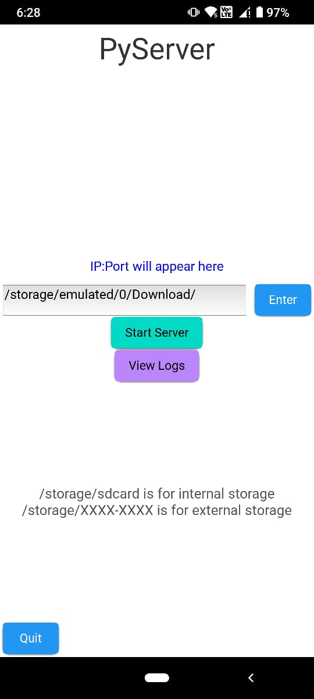
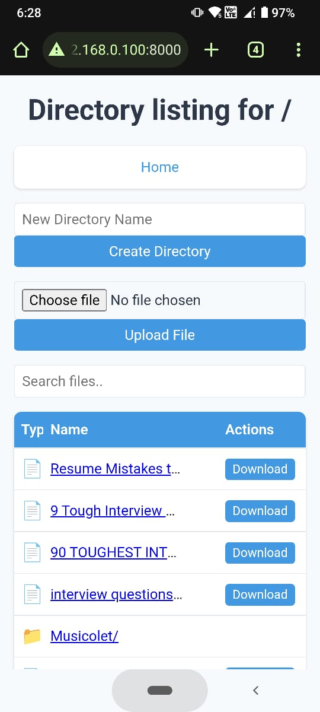
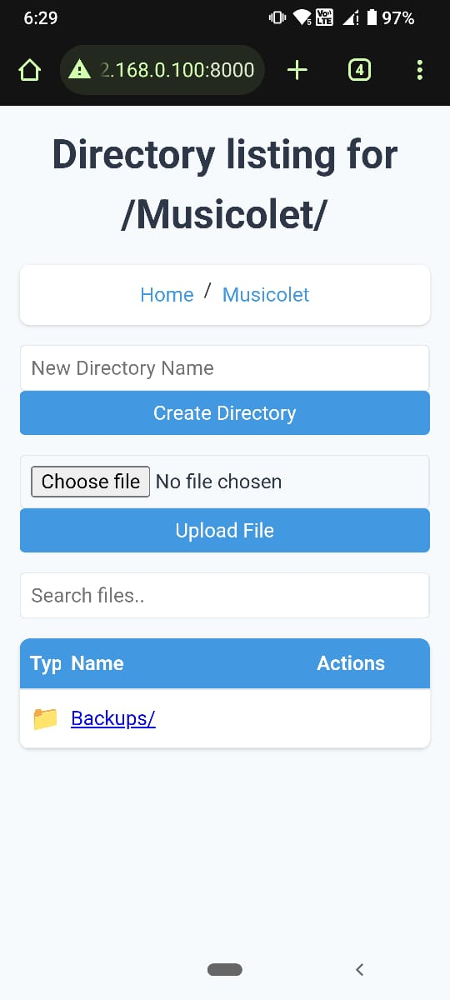

# FileShareApp-PyServer

FileShareApp is a cross-platform file sharing application designed to simplify the process of sharing files over a network. This application supports all major operating systems, including Linux, Windows, and Android, making it an ideal choice for organizations seeking a flexible and user-friendly solution for file sharing.

## Project Overview

FileShareApp allows users to share files easily by serving a specified directory over HTTP. Users can simply enter the path of the directory they wish to share, and the application will handle the rest. The application offers an intuitive interface with real-time logging and QR code generation for easy access to the shared files from any device.

### Key Features

- **Cross-Platform Support**: Compatible with Linux, Windows, and Android, ensuring accessibility for all users regardless of their operating system.
- **User-Friendly Directory Input**: Users can enter the path of the directory they want to share instead of selecting it through a file chooser, streamlining the sharing process.
- **Real-Time Logging**: Logs actions and events, allowing users to track operations and identify issues easily.
- **QR Code Generation**: Generates a QR code for quick access to the shared directory URL, enabling users to connect effortlessly from their mobile devices.
- **File Upload and Download**: Supports file upload and download functionality, allowing users to manage files directly through the web interface.
- **Directory Management**: Users can create new directories within the shared path, facilitating organized file sharing.
- **Search Functionality**: Includes a search bar for users to filter files and directories, enhancing user experience and efficiency.
- **Modern UI Design**: Utilizes HTML and CSS to provide a visually appealing and user-friendly interface for file navigation.

## Code Overview

### Directory Listing Handler

The `DirectoryListingHandler` class handles HTTP requests and serves a specified directory. Key methods include:

- **`list_directory(self, path)`**: Lists files and directories in the specified path, displaying them in an organized HTML table with options for download.

- **`do_GET(self)`**: Manages GET requests, including downloading files and listing directories.

- **`do_POST(self)`**: Handles POST requests for uploading files and creating directories.

### File Upload and Download

- **File Upload**: Users can upload files using a multipart/form-data encoding. The application extracts file data and saves it securely while preventing directory traversal attacks.
  
- **File Download**: The application serves files directly to users, allowing them to download files by clicking links in the directory listing.

### Directory Management

- Users can create new directories through a simple interface, allowing for organized file sharing.

### Search Functionality

- The application includes JavaScript for filtering file listings, making it easier for users to find specific files quickly.

## Advantages

1. **Simplicity**: The application offers a straightforward interface for entering directory paths, making it easier for users to share files without navigating complex file structures.
2. **Accessibility**: With support for multiple platforms, the application ensures that users can share files regardless of their device, promoting collaboration across diverse environments.
3. **Flexibility**: Users can easily upload and download files while managing directories, providing a comprehensive solution for file sharing needs.
4. **Enhanced Security**: By allowing users to enter directory paths, the application mitigates risks associated with file choosers that may inadvertently expose sensitive directories.
5. **Live Logging**: The built-in logging system helps users monitor activities, troubleshoot issues, and maintain a record of file sharing events.
6. **Modern Design**: The application features a clean and modern UI that improves user experience and makes file sharing intuitive.

## Comparison with Python's `http.server`

While Python's built-in `http.server` is a basic solution for serving files over HTTP, FileShareApp offers significant enhancements:

- **User Interface**: FileShareApp provides a modern graphical interface for user interaction, while `http.server` operates through the command line.
- **Directory Input**: Unlike `http.server`, which requires manual file selection, FileShareApp allows users to input directory paths directly, simplifying the sharing process.
- **QR Code Generation**: FileShareApp generates a QR code for quick access to the shared files, a feature that `http.server` lacks.
- **File Upload Support**: FileShareApp allows users to upload files directly to the server, whereas `http.server` only supports file downloads by default.
- **Search Functionality**: FileShareApp includes a search bar for filtering files, which enhances usability compared to the static list provided by `http.server`.
- **Cross-Platform Compatibility**: FileShareApp is designed to work on multiple platforms, enhancing its usability in varied organizational environments.

## Conclusion

FileShareApp is a powerful, user-centric file sharing solution that addresses the limitations of traditional file servers. Its focus on cross-platform support, user-friendly directory management, and comprehensive features makes it an excellent choice for organizations seeking to enhance their file sharing capabilities.
